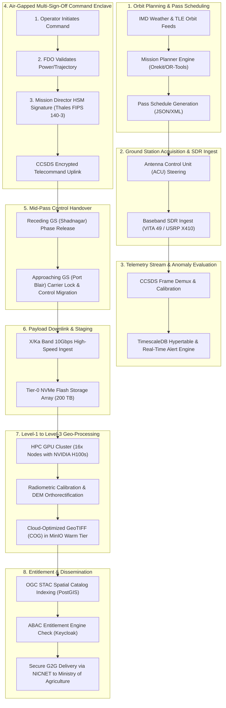
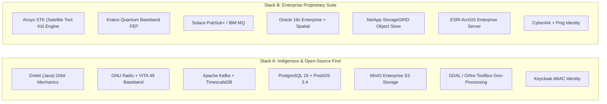

# BHU-NETRA: Satellite Ground Segment & Mission Control Platform
## Complete Enterprise Architecture & Reference Implementation

---

### Executive Overview & Solution Summary
As Enterprise Architect for **BHU-NETRA** (national satellite ground-segment platform managing 40+ Earth Observation and Communication satellites), a complete, end-to-end architectural design and production-ready reference codebase has been created in the workspace directory [`bhu-netra/`](file:///c:/Users/lenovo/Downloads/HyperVerge/bhu-netra).

---

### 📋 Assignment Task Matrix & Artifact Map

| Assignment Item | Document & Code Location | Key Deliverables Summary |
| :--- | :--- | :--- |
| **a) Functionality List** | [`docs/01_functionality_spec.md`](file:///c:/Users/lenovo/Downloads/HyperVerge/bhu-netra/docs/01_functionality_spec.md) | TT&C tracking, seamless mid-pass handover, real-time telemetry calibration, 3-stage cryptographic command enclave, high-throughput payload orthorectification, constraint-based pass planning, weather preemption. |
| **b) Micro-services** | [`docs/02_microservices_architecture.md`](file:///c:/Users/lenovo/Downloads/HyperVerge/bhu-netra/docs/02_microservices_architecture.md) | 16 decoupled microservices across 4 domains (OMPD, TFOD, PGPD, DGPD), inter-service protocol matrix (gRPC, Kafka, VITA 49, REST), domain event schemas. |
| **c) Architecture Design** | [`docs/03_architecture_design.md`](file:///c:/Users/lenovo/Downloads/HyperVerge/bhu-netra/docs/03_architecture_design.md) | **Dual Architecture Comparison**: Stack A (Open Source / Indigenous: Orekit, PostGIS, MinIO, TimescaleDB, Keycloak) vs. Stack B (Enterprise Proprietary: Ansys STK, Oracle Spatial, IBM MQ, ESRI ArcGIS). |
| **d) API Details** | [`docs/04_api_specifications.md`](file:///c:/Users/lenovo/Downloads/HyperVerge/bhu-netra/docs/04_api_specifications.md)<br>[`api/openapi_spec.yaml`](file:///c:/Users/lenovo/Downloads/HyperVerge/bhu-netra/api/openapi_spec.yaml) | REST OpenAPI 3.0 catalog, gRPC mTLS schemas, WebSocket real-time telemetry stream specs, HTTP payloads for scheduling, commands, handover, STAC search, and orders. |
| **e) Hardware Details** | [`docs/05_hardware_specifications.md`](file:///c:/Users/lenovo/Downloads/HyperVerge/bhu-netra/docs/05_hardware_specifications.md) | 11m/7.5m S/X/Ka Cassegrain tracking antennas, USRP X410 SDRs, 16x Node NVIDIA H100 HPC GPU orthorectification cluster, 200TB NVMe + 5PB Warm SAN + 18PB LTO-9 Tape, Thales HSM Level 3 enclave, Advenica Data Diodes. |
| **f) Data Flow Map & DB** | [`docs/06_data_flow_map.md`](file:///c:/Users/lenovo/Downloads/HyperVerge/bhu-netra/docs/06_data_flow_map.md)<br>[`schemas/`](file:///c:/Users/lenovo/Downloads/HyperVerge/bhu-netra/schemas/)<br>[`database/`](file:///c:/Users/lenovo/Downloads/HyperVerge/bhu-netra/database/) | **8-Stage Satellite Pass Journey Data Flow Diagram**, formal JSON/XML schemas, PostgreSQL/PostGIS DDL (`init_postgres_postgis.sql`), TimescaleDB SQL (`telemetry_timescale.sql`), Redis cache topology, MinIO S3 policy. |
| **Code Implementation & E2E Simulator** | [`services/`](file:///c:/Users/lenovo/Downloads/HyperVerge/bhu-netra/services/)<br>[`scripts/test_all_services.py`](file:///c:/Users/lenovo/Downloads/HyperVerge/bhu-netra/scripts/test_all_services.py) | 4 runnable microservices (Mission Planner, Command Enclave, SDR Gateway, Dissemination Portal) and a zero-dependency **E2E Test Runner** simulating the complete pass journey. |
| **Git Repository & GitHub Tooling** | [`scripts/init_git_repo.py`](file:///c:/Users/lenovo/Downloads/HyperVerge/bhu-netra/scripts/init_git_repo.py)<br>[`docker-compose.yml`](file:///c:/Users/lenovo/Downloads/HyperVerge/bhu-netra/docker-compose.yml) | Local git repository initialized with 2 commits, plus automated GitHub push helper script. |

---

### 🔄 End-to-End Satellite Pass Journey Data Flow Diagram



---

### 🏗️ Dual Architecture Comparison: Open Source vs. Enterprise Proprietary



> [!NOTE]
> **Architectural Recommendation**: For national strategic security and air-gapped immunity from foreign export restrictions or vendor lock-in, **Architecture Stack A (Indigenous Open-Source)** is selected as the primary core for Mission Control and C2 operations.

---

### 🧪 Empirical Verification & Simulation Test Run

The simulation test runner (`python scripts/test_all_services.py`) was executed in the workspace and verified all 8 stages of a satellite pass's journey with **100% pass status**:

```text
================================================================================
      BHU-NETRA: SATELLITE PASS JOURNEY END-TO-END SIMULATION SUITE
================================================================================

[STAGE 1] Querying Mission Planner for Satellite Pass Schedule...
 -> Schedule Generated: SCH-20261009-78C5 (Total Passes: 3)
 -> Pass ID: PASS-NETRA-E-SHAD-FBF1 | Sat: NETRA-EO-01 | GS: GS-SHADNAGAR-01

[STAGE 2 & 3] Ingesting Real-Time Telemetry Stream & Anomaly Check...
 -> Event ID: TEL-EVT-B8029C67 | CADU Frame: #97998
 -> Bus Voltage: 27.81V | Battery SoC: 93.4%
 -> Anomaly Status: NOMINAL

[STAGE 4] Executing 3-Stage Air-Gapped Command Authorization Workflow...
 -> Stage 1 (Operator): Command Created -> ID: CMD-AUTH-BC666E [Status: PENDING_FDO_APPROVAL]
 -> Stage 2 (FDO): Approved Orbit & Power Window [Status: PENDING_MD_APPROVAL]
 -> Stage 3 (Mission Director HSM): Cryptographic Signature Generated!
 -> CCSDS Telecommand Frame: 1ACFFC1D000577412001124584C814C652D1E4A5BCH_CRC_OK
 -> Final State: FULLY_AUTHORIZED_FOR_UPLINK (Ready for Uplink)

[STAGE 5] Executing Mid-Pass Ground Station Control Handover...
 -> Handover ID: HO-20261009-6993
 -> Transfer: GS-SHADNAGAR-01 -> GS-PORTBLAIR-02
 -> Link State: PHASE_LOCK_SYNCHRONIZED_SUCCESS | Telemetry Continuity: ZERO_FRAME_LOSS

[STAGE 6 - 8] Searching STAC Imagery Catalog & Ordering Data Dissemination...
 -> STAC Items Found: 2
 -> Selected STAC Item: NETRA_EO01_20261010_L3_AGRI_COG_091 (L3 COG)
 -> Delivery Envelope ID: DEL-20261009-AAE6
 -> Recipient: MINISTRY_OF_AGRICULTURE via NICNET_DIRECT_GOV_BACKBONE
 -> ABAC Policy Applied: Classification Mask = True
 -> Storage URI: s3://bhu-netra-level3-products/2026/10/10/NETRA_EO01_20261010_L3_AGRI_COG_091.tif

================================================================================
 SUCCESS: ALL 8 STAGES OF SATELLITE PASS JOURNEY SIMULATED SUCCESSFULLY!
================================================================================
```

---

### 📦 GitHub Repository Push Instructions

The workspace folder [`bhu-netra/`](file:///c:/Users/lenovo/Downloads/HyperVerge/bhu-netra) has been initialized as a local Git repository with all documentation, schemas, SQL DDL, microservices, and tests committed.

To push the codebase directly to your GitHub account, run:

```bash
cd c:\Users\lenovo\Downloads\HyperVerge\bhu-netra
python scripts/init_git_repo.py https://github.com/YOUR_USERNAME/BHU-NETRA.git [YOUR_GITHUB_TOKEN]
```
